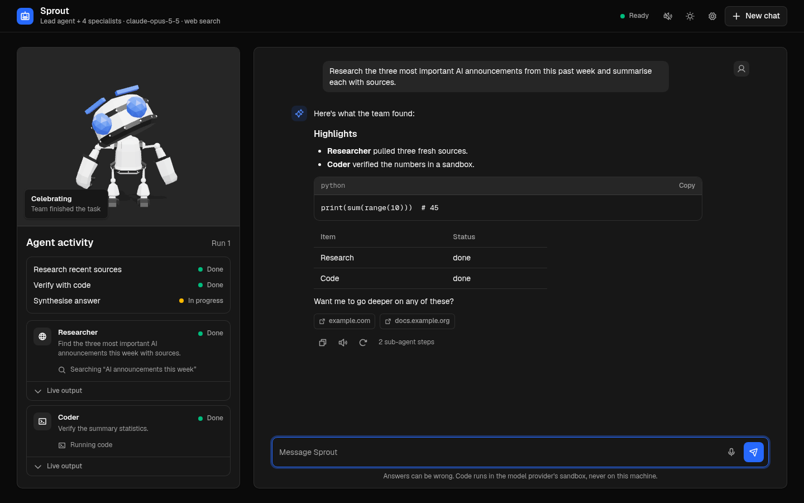

# Sprout 🌱

A 3D robot avatar that **leads a team of AI agents**. Ask anything: Sprout answers simple
things itself and delegates the rest to specialists, while you watch each step live and
the avatar reacts to what the team is doing.



| Specialist | Does | Tools (run on Anthropic's servers) |
|---|---|---|
| Researcher | Live web research with sources | `web_search`, `web_fetch` |
| Coder | Writes and runs code | code-execution sandbox |
| Writer | Emails, docs, summaries | None |
| Planner | Breaks goals into steps | None |

**Features:** streamed answers with Markdown/code/tables · parallel sub-agents with a live
activity timeline and plan checklist · source chips · stop / retry / copy / export ·
speech-to-text dictation and spoken replies with lip-sync · dark + light themes ·
mobile layout · reduced-motion support · history kept in your browser only.

## Quick start

```bash
bun install
cp .env.example .env      # add ANTHROPIC_API_KEY
bun run start             # http://127.0.0.1:8787
```

## Configure

| Provider | Set | Mode |
|---|---|---|
| Anthropic (recommended) | `ANTHROPIC_API_KEY` | Full agent team, web search, code sandbox (`claude-opus-5-5`) |
| xAI | `XAI_API_KEY` | Solo agent |
| Ollama | running locally | Solo agent, offline |

With no provider configured, the UI shows a setup banner and does not invent answers.

## How it works

`POST /api/chat` streams Server-Sent Events. The lead agent uses three tools: `delegate`,
`plan` and `emote`. Specialists run as their own streamed Claude calls, and only their final
text returns to the lead. Caps refuse rather than truncate: at most 8 delegations and 10
rounds per reply, and specialists cannot delegate further. The event names follow
[AG-UI](https://docs.ag-ui.com), and the orchestration guard rails are adapted from
[CopilotKit/OpenBot](https://github.com/CopilotKit/OpenBot) (MIT).

Security: API keys never leave the server. Each IP is rate-limited (10 burst, 10/min), the
body is capped at 64 KB, payloads are validated, a strict CSP is sent, the server binds to
`127.0.0.1` by default, and model output is rendered without `innerHTML`.

## Credits

- 3D robot: [RobotExpressive](https://github.com/mrdoob/three.js/tree/r185/examples/models/gltf/RobotExpressive) by Tomás Laulhé ([Quaternius](https://quaternius.com)), CC0; morphs by Don McCurdy.
- 3D engine: [three.js](https://github.com/mrdoob/three.js) `r185`, MIT.
- Original 2D prototype kept in `prototype/`.
- Icons: [Lucide](https://github.com/lucide-icons/lucide) `0.544.0`, ISC.
- Fonts: [Inter](https://github.com/rsms/inter) `v4.1` and [JetBrains Mono](https://github.com/JetBrains/JetBrainsMono) `v2.304`, both OFL-1.1.
- Sounds: [Kenney Interface Sounds](https://kenney.nl), CC0, via [smaltra/soundix](https://github.com/smaltra/soundix) `f8d863b`.

Full license texts are in `public/assets/licenses/`.
